# Architecture

Claim Management System — healthcare professional claims.
Java 21 · Spring Boot 4.1.1 · PostgreSQL 17 · React 19 + TypeScript · Docker Compose

Every diagram below is Mermaid and renders on GitHub, in VS Code with the Mermaid extension, and at mermaid.live.

---

## 1. System context

Who and what the system talks to. Phase 2 integrations are drawn dashed because they are specified but not built.

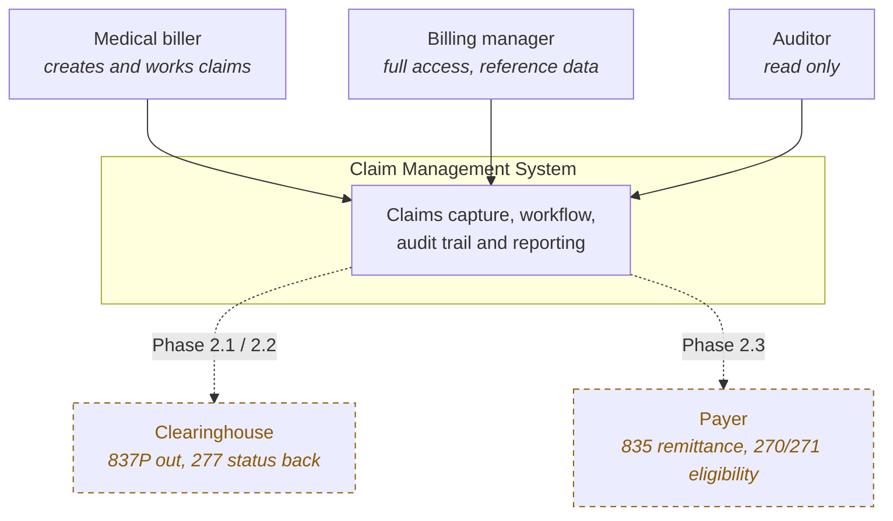

---

## 2. Container diagram

What actually runs, and how the pieces talk. All three containers sit on one Docker network; only the SPA and the API are published to the host.

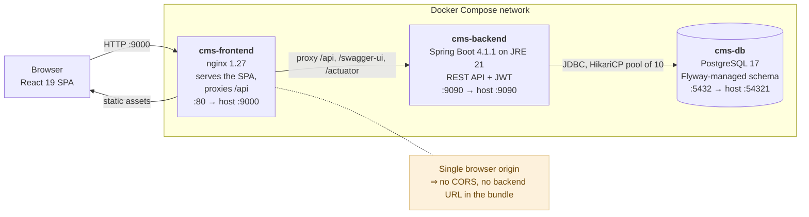

**Why nginx proxies the API rather than the SPA calling `:9090` directly:** the browser only ever sees one origin, which removes CORS configuration, keeps the backend hostname out of the JavaScript bundle, and means the same image works in any environment without a rebuild.

---

## 3. Component diagram — backend

Layering inside the Spring Boot application. Arrows point the way calls flow. Nothing skips a layer.

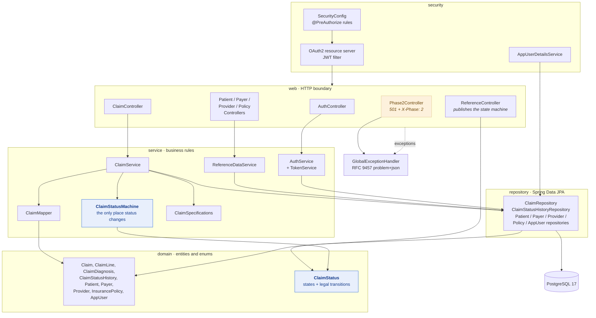

**The load-bearing idea:** `ClaimStatus` (an enum) owns the transition table, `ClaimStatusMachine` is the only code that changes a claim's status, and `GET /api/reference/status-transitions` serialises that same enum to the UI. Three layers, one source of truth, no possibility of the button set disagreeing with what the API will accept.

---

## 4. Entity relationship diagram

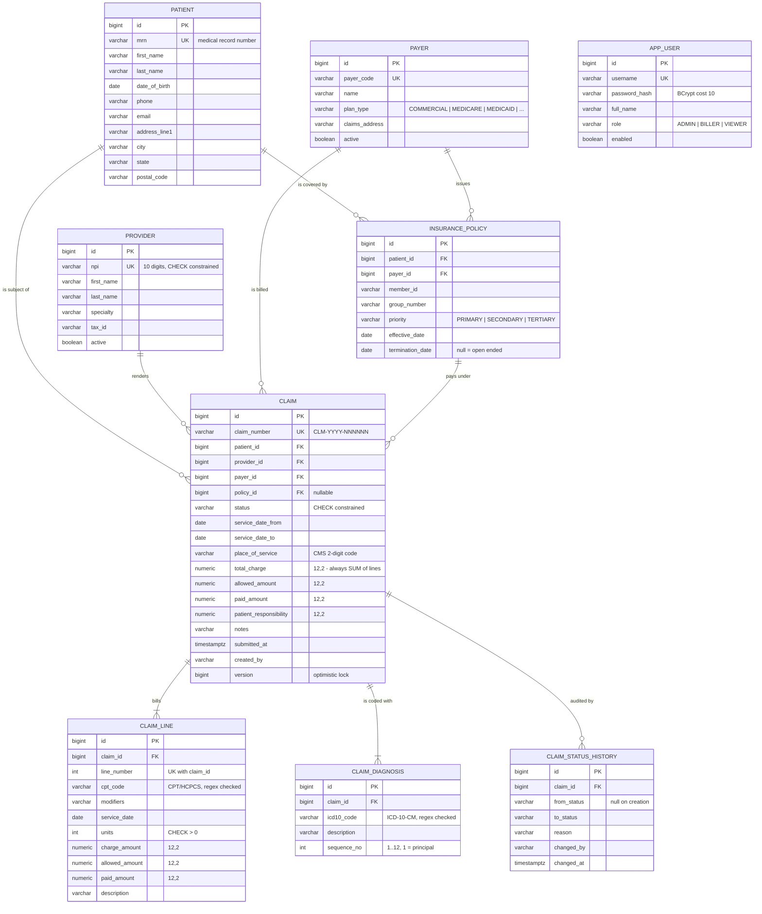

### Schema decisions worth defending

| Decision | Reason |
|---|---|
| `NUMERIC(12,2)` for every money column | Floating point in a billing system produces reconciliation defects that surface months later. |
| `CHECK` constraints on status, CPT, ICD-10, NPI, units, dates | The database refuses bad data even if a future service bypasses the API. Defence in depth. |
| `claim_status_history` is append-only | The audit trail is the compliance artefact. Nothing in the codebase issues `UPDATE` or `DELETE` against it. |
| `@Version` on `claim` | Two billers editing the same draft is routine. The second save gets a 409, not a silent overwrite. |
| Partial index `WHERE status NOT IN ('PAID','VOID')` | Open AR is the hot query. Indexing only open rows keeps it small as history grows. |
| Flyway with `ddl-auto: validate` | Schema is versioned and reviewable. Hibernate never alters a claims table. |

---

## 5. Claim status state machine

The workflow, exactly as `ClaimStatus` encodes it.

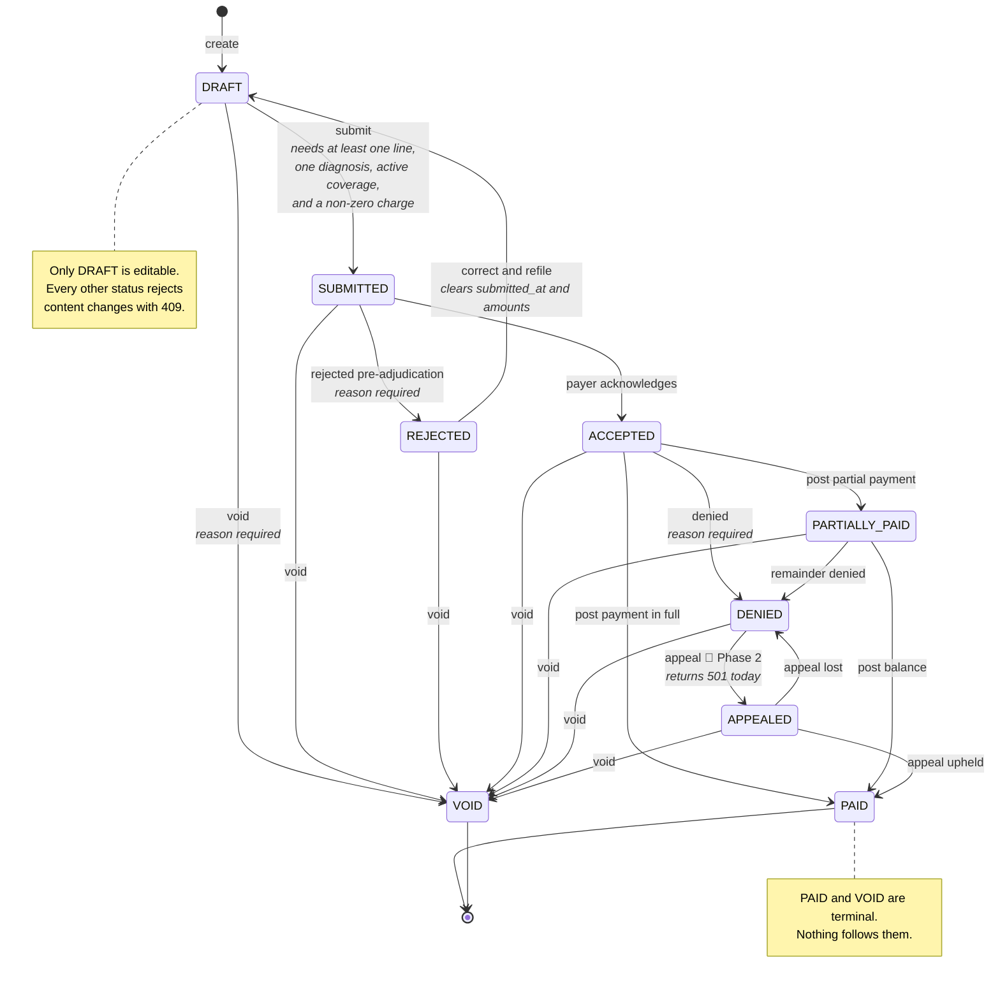

### Guard rules enforced in `ClaimStatusMachine`

| Transition | Guard | Side effect |
|---|---|---|
| `→ SUBMITTED` | ≥1 line, ≥1 diagnosis, total charge > 0, policy active on the service date | sets `submitted_at` |
| `→ REJECTED` `→ DENIED` `→ VOID` | reason is mandatory | — |
| `REJECTED → DRAFT` | — | clears `submitted_at`, allowed, paid and patient responsibility |
| `→ PAID` | `paidAmount` required and ≤ allowed | sets allowed, paid, and patient responsibility = allowed − paid |
| `→ PARTIALLY_PAID` | `paidAmount` > 0 and strictly < allowed | same, balance stays outstanding |
| `DENIED → APPEALED` | blocked in Phase 1 | returns 501 with a pointer to the spec |
| anything else | not in the transition table | 409 listing what *is* allowed from here |

---

## 6. Sequence — authentication

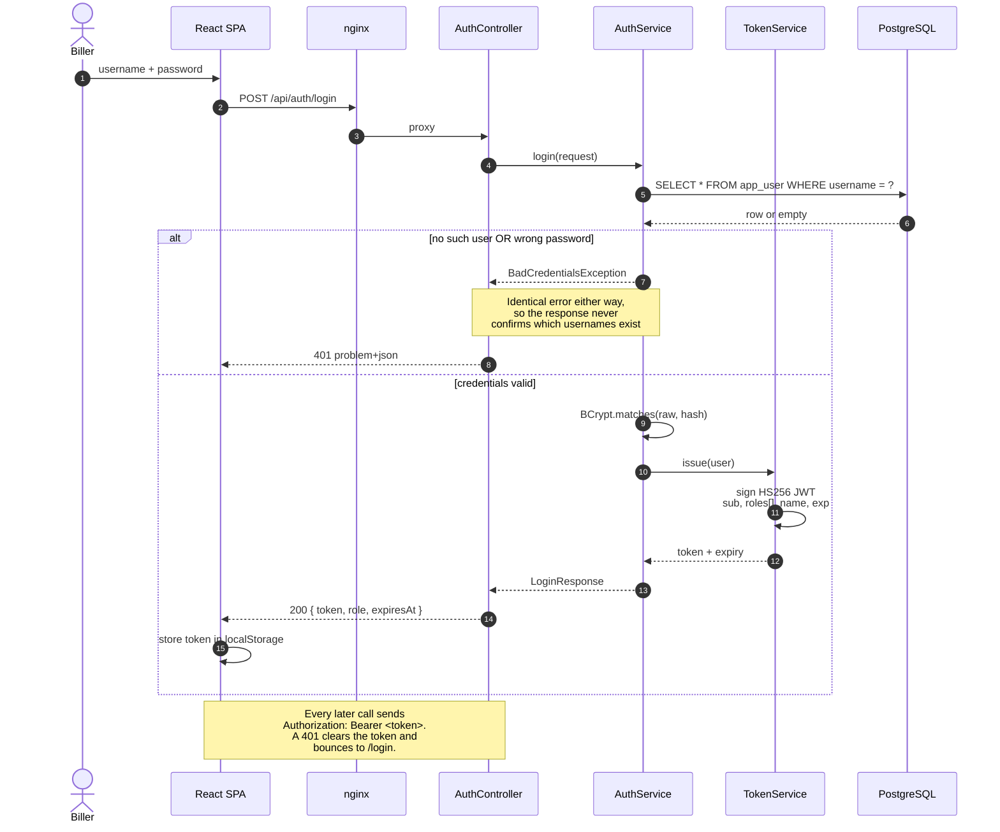

---

## 7. Sequence — create a claim

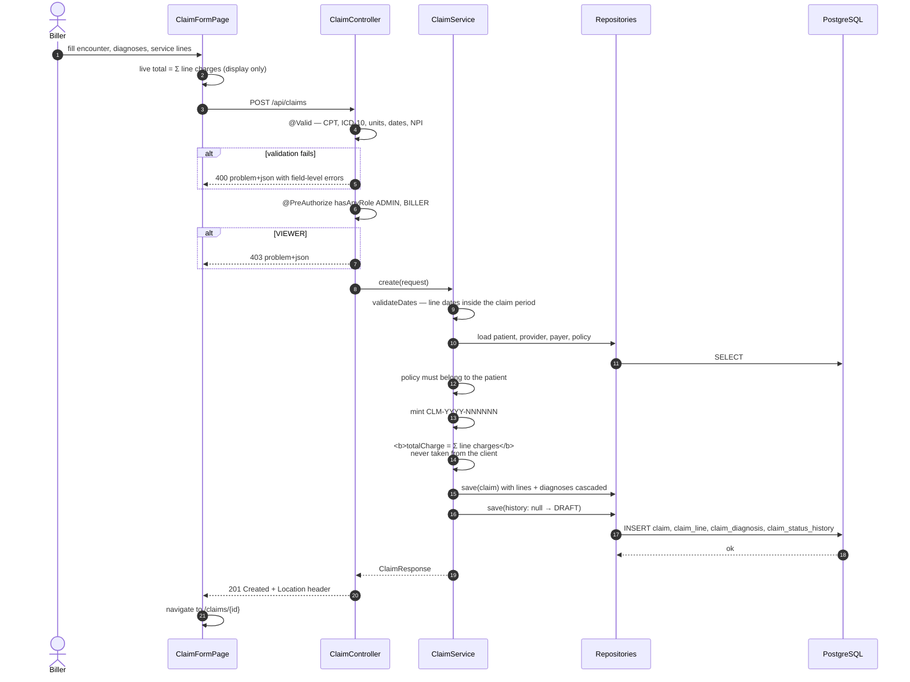

---

## 8. Sequence — submit a claim, and what happens when it cannot be submitted

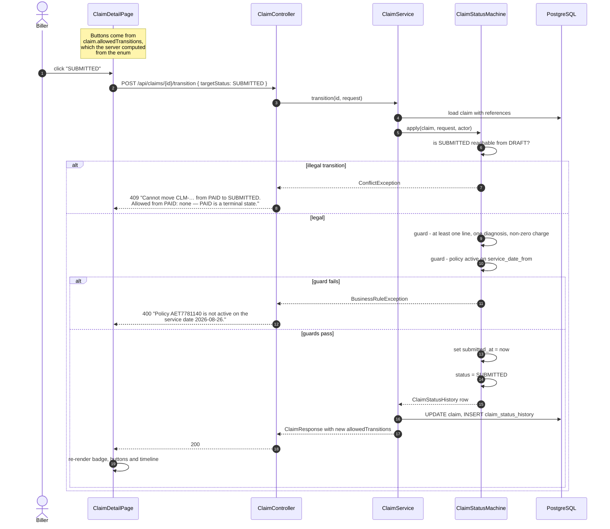

---

## 9. Sequence — posting a payment

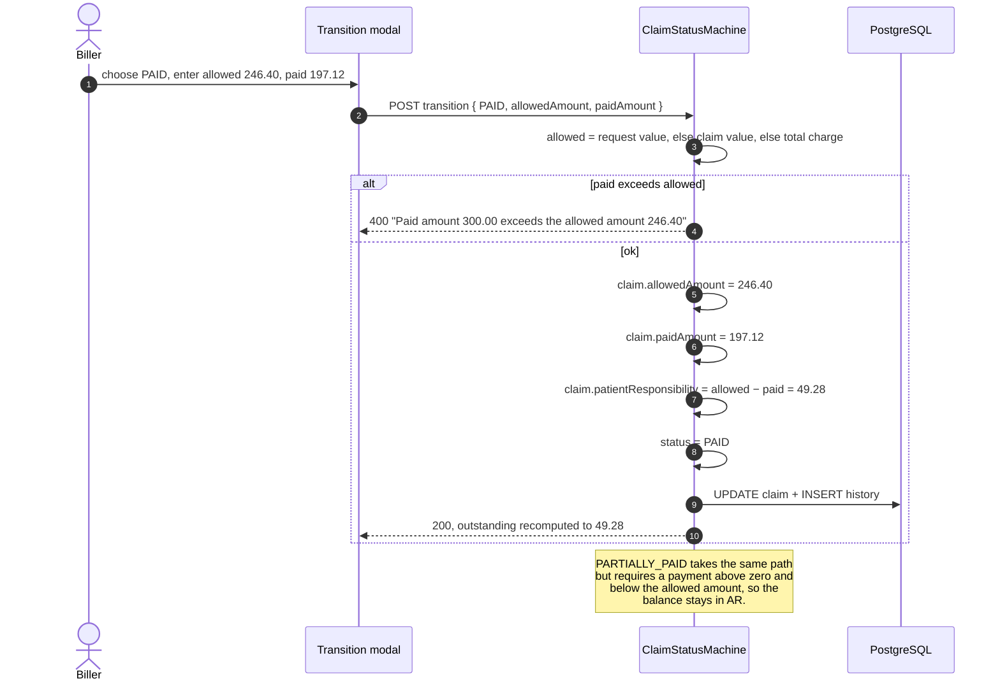

---

## 10. Sequence — a Phase 2 endpoint

The handoff is visible at runtime, not only in a document.

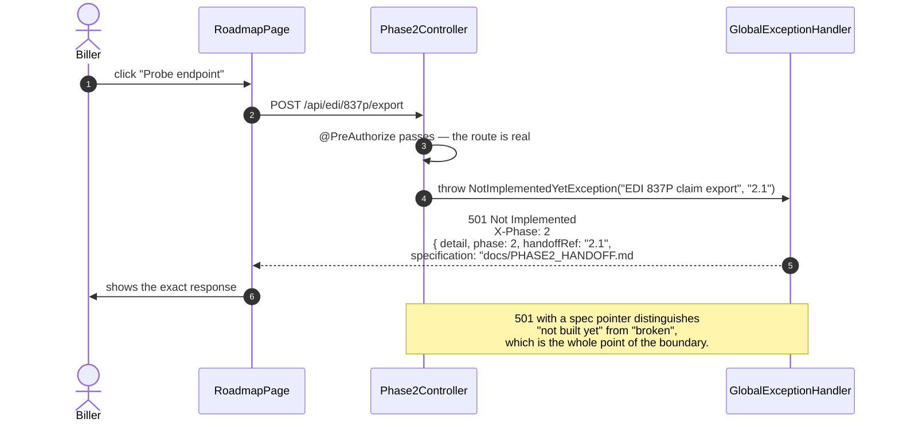

---

## 11. Request flow through the stack

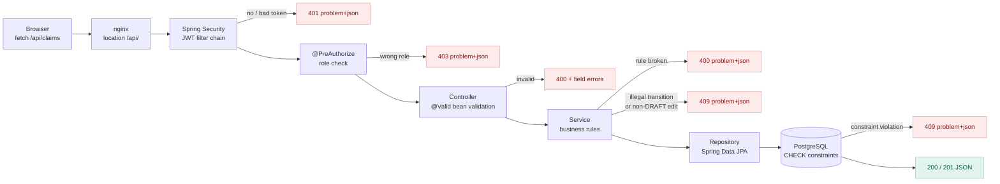

Five independent layers can reject a request, and each returns the same RFC 9457 `problem+json` shape. The client handles one error format.

---

## 12. Deployment topology

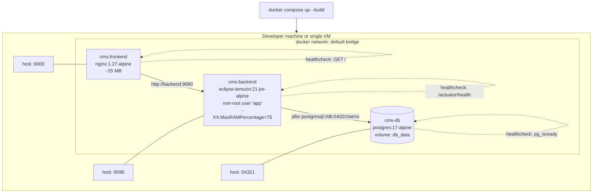

**Startup ordering is enforced by health, not by sleep.** `backend` waits for `db` to report `service_healthy`; `frontend` waits for `backend`. Flyway runs its migrations on backend start, so the schema and the seed data exist before the first request.

---

## 13. Build pipeline inside the images

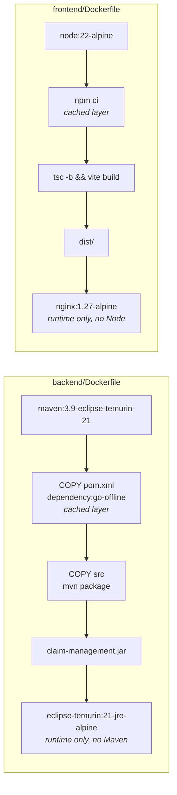

Multi-stage on both sides: the build toolchain never ships. The runtime images carry a JRE and a static web server, nothing else.

---

## 14. Phase roadmap

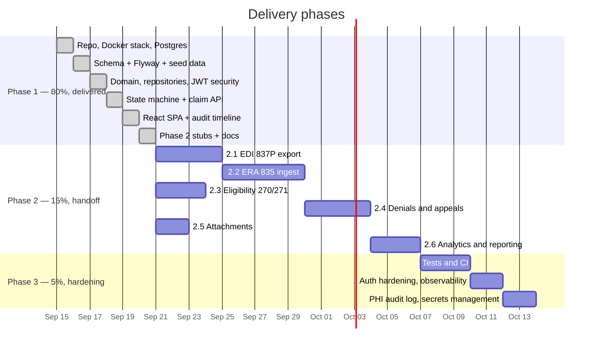

---

## 15. Where each rule lives

A single claim rule should exist in exactly one place. This is the map.

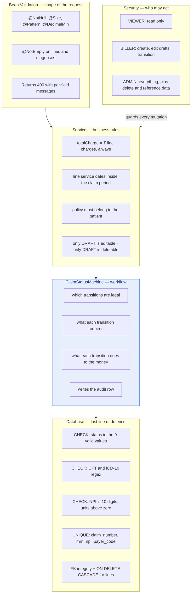

---

## 16. What was deliberately left out of Phase 1

Not oversights. Each is a decision with a reason.

| Left out | Why | Where it goes |
|---|---|---|
| Real EDI 837/835 generation and parsing | X12 is a large specification and a demo does not need a valid interchange to show the workflow | Phase 2.1 / 2.2 |
| Payer connectivity (eligibility, claim status) | Needs credentials and a trading-partner agreement that a demo cannot have | Phase 2.3 |
| Appeals | Depends on denial reason codes, which arrive with the 835 | Phase 2.4 |
| File storage for attachments | Needs an object store and a retention policy decision | Phase 2.5 |
| AR aging and denial analytics | Cheap to add once the lifecycle data exists; adds nothing to a workflow demo | Phase 2.6 |
| Automated tests | The tests worth writing are integration tests against a real Postgres, which belongs with CI | Phase 3.1–3.3 |
| Refresh tokens, rate limiting, PHI access log | Production concerns, not workflow concerns | Phase 3.4–3.8 |
